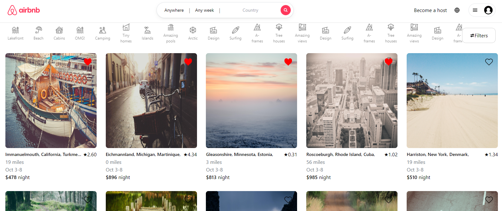

# Airbnb Clone

## Table of contents

- [Overview](#overview)
  - [The challenge](#the-challenge)
  - [Screenshot](#screenshot)
  - [Links](#links)
- [My process](#my-process)
  - [Built with](#built-with)
  - [What We learned](#what-we-learned)
- [Authors](#authors)

## Overview

### The challenge

Users should be able to:

- Veiw homes that were fetched from the psql database
- Click on a home to view additional details about a property
- Filter homes by propery type
- Add favorite homes to a wishlist, saved in local state, view on the /wishlist page

### Screenshot

### Links

- Live URL - [Airbnb-Clone](https://a-team-airbnb-clone-static.onrender.com)

## Our Process

### Built with

- [React](https://reactjs.org/) - JS library
- [Tailwind](https://tailwindcss.com/) - JS library
- [Express](https://expressjs.com/) - Node library
- [PostgreSQL](https://www.postgresql.org/) - Database

### What we learned

This is my first fullstack app that utilized React. My aim was to create an application that allowed full CRUD to a live database. I wanted to build an application that had nested components to practive using props and state that was shared throughout the application. The more difficult area to work with was the database because of how the data needed to be set up (primary keys and foreign keys) in order to keep all relevant boards tasks and subtasks related to eachother.

### Authors

- [Kyle Jones](https://github.com/lowlyphe)
- [Hung Nguyen](https://github.com/Hung1693)
- [Thahn Huy Le](https://github.com/Sokiben93)
- [Matthew Rust](https://github.com/mahtjarohst)
- [Kevin Reaves](https://github.com/reaveskev)
